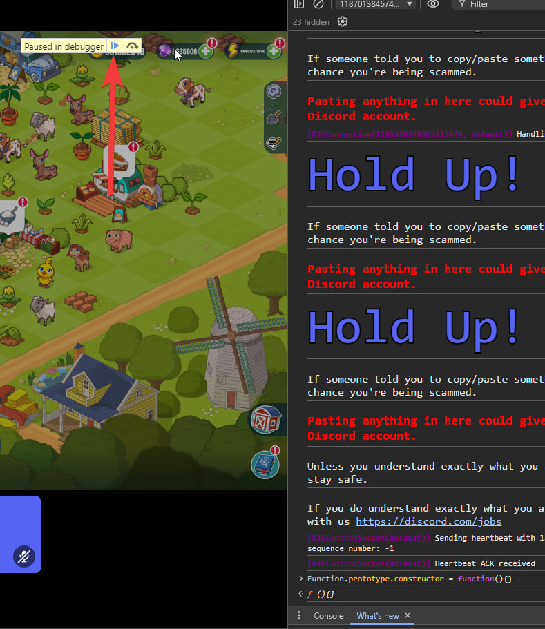
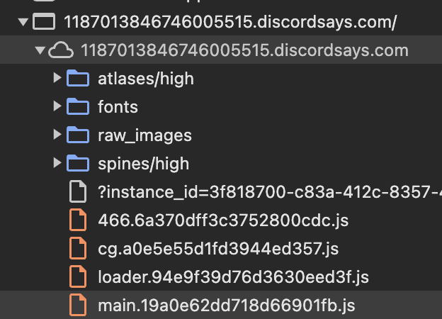
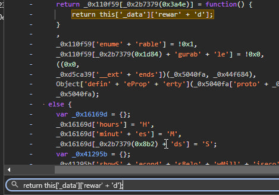
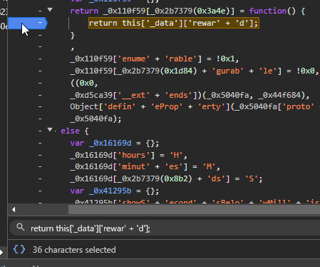
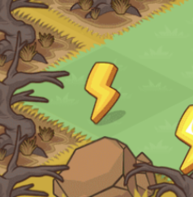
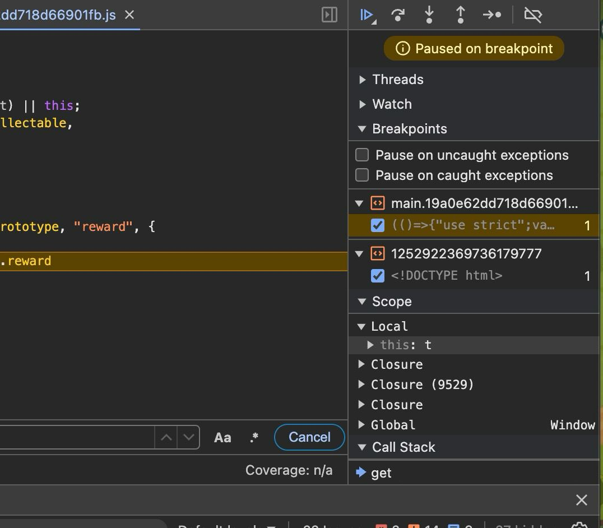
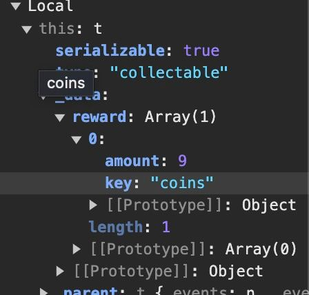
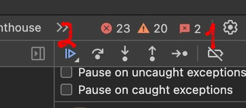
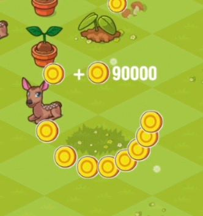

## Learning how to hack the game in 5 minutes! (Farm Merge Valley in Discord)
[](https://hits.sh/github.com/earluv/discord-farm-merge-valley-hack/)
 
### What you need?
- browser (preferably Google Chrome)
- 5 minutes of free time 
 
 
## What you can get with a hack: (enums)
<details> 
  <summary>Click to expand the information</summary>
 
| Parameter |   Is reward   | Description                |
| :-------- | :------- | :------------------------- |
| `coins` | True | Yellow coins |
| `gems` | True | Purple gems |
| `crates` | True | Crates with items |
| `energy` | True | Energy for activities |
| `tickets` | True | Train tickets |
| `wheat`         | True      | Wheat                 |
| `egg`           | True      | Egg                   |
| `sunflower`     | True      | Sunflower             |
| `milk`          | True      | Milk                  |
| `sugarcane`     | True      | Sugarcane             |
| `bacon`         | True      | Bacon                 |
| `carrot`        | True      | Carrot                |
| `goatmilk`      | True      | Goat milk             |
| `soybeans`      | True      | Soybeans              |
| `wool`          | True      | Wool                  |
| `corn`          | True      | Corn                  |
| `fur`           | True      | Fur                   |
| `coffeebeans`   | True      | Coffee beans          |
| `tomato`        | True      | Tomato                |
| `avocado`       | True      | Avocado               |
| `truffle`       | True      | Truffle               |
</details>
 
## Game functions for issuing rewards
 
| Function |    | Description                               |
| :-------- | :----- |:------------------------------------------|
| `return this['_data']['rewar' + 'd']`      | | Function to give away any item       |

## Process for obtaining game privileges
```
This post is made for educational purposes to understand how to bypass the game. I do not encourage using this method and am not responsible for your actions.
```
 
### Step 1 - Opening the console
<details>
  <summary>Click to expand the information</summary>
 
1) Join any voice channel and start the activity
2) Open the browser console `(F12, Ctrl+Shift+I or Cmd+Opt+I)`
3) Go to the `Console` tab
4) Paste `return this['_data']['rewar' + 'd']`
 
</details>
 
### Step 2 - Disable Debugging mode
<details>
  <summary>Click to expand the information</summary>
 
1) After pasted and pressed `Enter` click  on the triangle 
   
</details>

### Step 2 - Find function in the code and set a breakpoint
<details>
  <summary>Click to expand the information</summary>
 
1) Find the file `main.js` and open it
 
   
2) Press `Ctrl+F` and search the function `return this['_data']['rewar' + 'd']`
 
   
 
3) Click to the left on the gray line to place a breakpoint
 
   
 
</details>
 
### Step 3 - Bypassing the game
<details>
  <summary>Click to expand the information</summary>
 
1) Find any resource on the map
 
   
2) Click on it and you will see information in the `Scope` window
   
4) Click on the triangles where it says `this` and go to `reward`
   
5) ^ In the `amount` field, enter the value you want to issue, and in the `key` field, enter the resource name as indicated in the table above
6) Press 1 and then 2 in sequence
   
7) Watch as the items start being issued
 
   
</details>


### Result 🎉
 
If you did everything correctly, you should see the items you specified.
 
## Star the repo!!! ⭐
 
If I was able to help you, please star the repository. This will help me in my further work.
 
<h3> Important: This material is made for educational purposes only. I do not encourage using this method and am not responsible for your actions. </h3>
 
### Contact Me:
 
[Telegram](https://t.me/wooslow_dev)
 
[Discord](https://discord.gg/muk775Ndf4)
